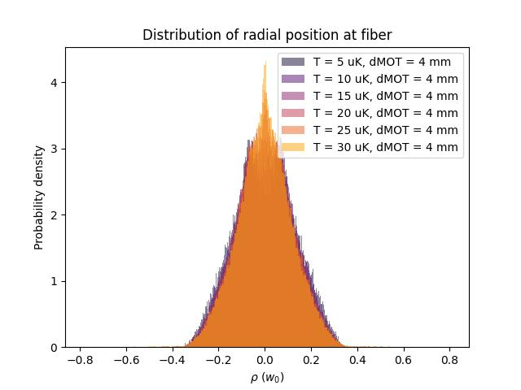

## 🚀 Example: Running and Analyzing a Simulation

Suppose you want to simulate the capture of **Rb atoms at T = 15 µK** with a **MOT–fiber distance dMOT = 5 mm**.

### Step 1 — Run the simulation
```bash
python simulation.py 15 5
````

This will:

* Generate **N = 1e5 atoms** initially distributed in the MOT.
* Evolve their trajectories under the optical dipole potential (Gaussian beam exiting the fiber).
* Save results in:

  ```
  ./data/res_T=15uK_dMOT=5mm/
  ├── positions.npy
  ├── velocities.npy
  └── times.npy
  ```

---

### Step 2 — Analyze the results

```bash
python analysis.py 15 5
```

This produces two plots:

1. **Capture fraction vs time** (percentage of atoms reaching the fiber core).
2. **Radial density distribution** at the fiber, compared with the initial MOT distribution.

Both plots are displayed interactively and can be saved manually.

---

### Step 3 — Run multiple simulations (parameter scan)

```bash
python run_multiple_simul.py
```

By default:

* Temperatures: 5, 10, 15, 20, 25, 30 µK
* MOT distances: 4, 8, 12, 16, 20 mm

This generates simulation data for each parameter set.

---

### Step 4 — Batch analysis and plots

```bash
python analysis_multiple_siml.py
```

This script automatically produces summary plots across all simulations:

* **Capture fraction vs time** (different curves for different T or dMOT).
* **Radial density distributions** at the fiber for different conditions.

The plots are saved in `./img/`.

---

### Typical Output

Example capture fraction plot:


Example density distribution at the fiber:


